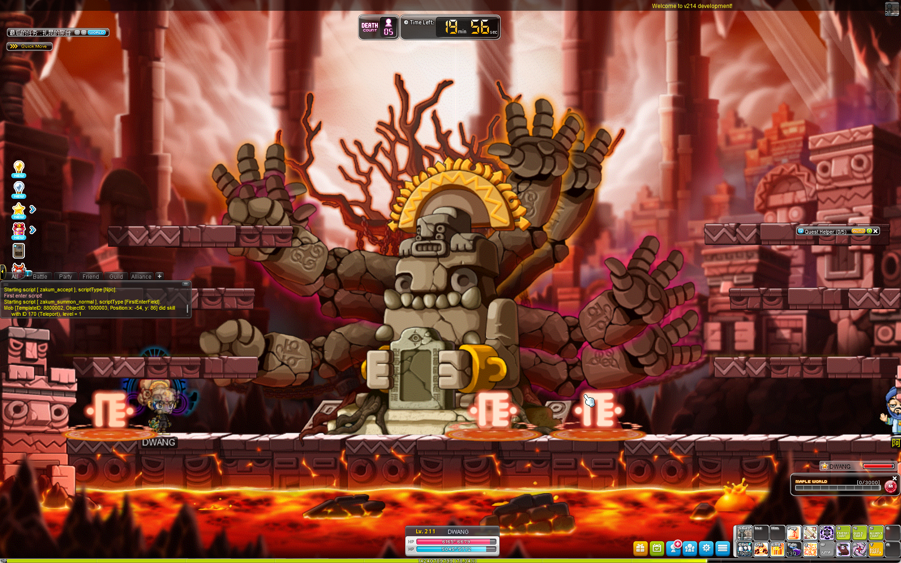
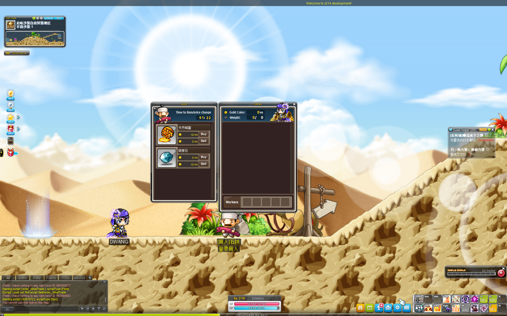

# A server emulator for Maplestory GMS v214.

原仓库地址：https://github.com/CoREse/gms214server

## 服务启动步骤：
1. 获取v214-server源码（本仓库）
2. JDK 17 
3. 导入sql数据，已修改成mysql8数据库，请提前安装mysql8数据库 
4. 修改配置，启动服务端，不报错即可

## 客户端启动：
1. 获取V214-client
2. AuthHook_v214 编译获取ijl15.dll，放在214client目录下覆盖 
3. launcher 编译获取v214.exe  登陆器用于注册和登录服务
4. v214.exe 放到客户端目录下
5. 点击v214.exe启动登陆器，点击注册账号，然后点击登录。注意查看服务端有没有收到发送的包。确认连接是否正常

hook和登陆器获取：https://github.com/Toxocious/Moonlight

## 注意事项
1. 为了更新日志版本。使用了lombok，IDEA安装lombok插件、设置搜索打开 Enable annotation processing
2. IDEA设置项目的resources文件夹。否则读不到配置文件路径
3. v214.exe 每次重启完服务器都要重新启动
4. resources/clientFile 放了编译好的hook和launcher 以及 简体中文的汉化

## 管理员指令
1. 刷道具：!item item_id item_num
999个核心宝石
eg:!item 2435719 999
2. 开核心：@nodes
3. 技能5sCD
4. !map map_id

---
## 当前特性
1. 更新日志打印，添加查看包处理日志、unknow日志优化打印
2. 更新汉化
3. 更新V矩阵

## 更新日志
### 2025-11-10
1. 修正商场的包头，解决商城商品无法拿出的问题
2. 修复Zakum现在可以挑战！

3. 修复遇到的脚本问题
4. quick move 新增V技能大师NPC

### 2025-11-14
1. 修复黑龙BOSS可以正常挑战、显示残骸
   
2. 修复套装和装备血量导致人物血量异常无法加满的问题

## 下一步计划
修复跑商，有感兴趣朋友可以交流 discord:dwang2379

当前最严重问题:
1. 没找到获取角色有多少钱，有什么东西的接口
   

